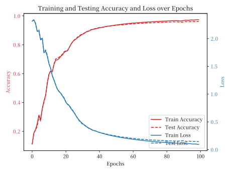
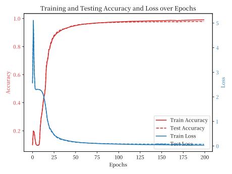
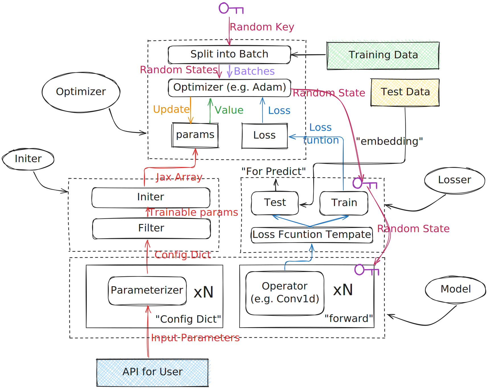

# 🔥 Classic DeepLearning Models by Jax

> <ins>💡: The Latest Framework test case is under: `./example/`.</ins>  

<p align="center">
  
  
</p>

<p align="center">
On MNIST: (a) acc[96.80%] & loss vs. epochs for mlp; (b) acc[98.24%] & loss vs. epochs for LeNet  
</p>


## # models implemented in this project

- Linear Regression
  - Self Made Gauss-Noise of a Function.
- Logistic Regression
  - Iris.
- KNN
  - CIFAR-10. 
- MLP
  - MNIST.
  - CIFAR-10.
- LeNet[[1](#reference)]
  - MNIST.
  - CIFAR-10.
- LSTM
  - UCI HAR.
- GRU[[3](#reference)]
  - UCI HAR.
- Transformer[[4](#reference)]
  - WMT15. <mark>TODO</mark>
- Nerual ODE[[5](#reference)]
  - MNIST. <mark>TODO</mark>
- VAE[[7](#reference)]
  - MNIST. 

## # NoteBook Docs

Some small tests for debug during the development of this project:   

- How to Use Mini-torch? <ins>*A brief e.g. Doc*</ins>  <mark>TODO</mark>
- How to Use Jax Gradient, <ins>*Ideas about how I manage parameters in this Framework*</ins>. 
- Some Jax Tips, <ins>*About How to Use Jax Builtins & JIT to Optimize Loops & Matrix Operations.*</ins>   
- Kaiming Initialization[[2](#reference)] used in MLP & Conv, <ins>*With math derivation.*</ins>  
- Difference between Conv2d Operation by python loop and by <ins>**Jax.lax**</ins>.
- Dropout mechanism impl, <ins>*About Seed in Jax*.</ins>
- Runge-Kuta solver for Neural ODE.

## # Mini-torch

<p align="center">
  
</p>

<p align="center">
Overview of Framework
</p>

- nn
  - Model (Base Class for Nerual Networks, like nn.Module in torch)
  - Conv
    - Conv1d, Conv2d, Conv3d
    - MaxPooling1d, MaxPooling2d, MaxPooling3d
    - BatchNorm <mark>TODO</mark>
  - RnnCell
    - Basic rnn kernel
    - LSTM kernel
    - GRU kernel
    - BiLSTM kernel
    - BiGRU kernel 
    - Layer Norm <mark>TODO</mark>
  - FC
    - Dropout
    - Linear
- Optimizer
  - Algorithms
    - Raw GD
    - Momentum
    - Nesterov(NAG)
    - AdaGrad
    - RMSProp
    - AdaDelta
    - Adam[[6](#reference)]
  - Machanisms
    - Lr Decay. <mark>TODO</mark>
    - Weight Decay. <mark>TODO</mark>
    - Freeze. <mark>TODO</mark>
- Utils
  - sigmoid
  - one hot
  - softmax
  - cross_entropy_loss
  - mean_square_error
  - l1_regularization
  - l2_regularization

#### @ Number of Codes

Last update: 2025.03.14.   

```text
     236 text files.
     135 unique files.                              
     138 files ignored.

github.com/AlDanial/cloc v 1.98  T=0.05 s (2810.5 files/s, 307803.1 lines/s)
-------------------------------------------------------------------------------
Language                     files          blank        comment           code
-------------------------------------------------------------------------------
Python                          33           1689           3297           3177
Jupyter Notebook                21              0           3947           1913
Text                             6              1              0            301
CSV                             68              0              0            203
Markdown                         5             40              0            198
TOML                             2              3              0             16
-------------------------------------------------------------------------------
SUM:                           135           1733           7244           5808
-------------------------------------------------------------------------------
```

# Reference

[[1](https://ieeexplore.ieee.org/document/6795724)] LeCun, Y., Boser, B., Denker, J., Henderson, D., Howard, R., Hubbard, W., & Jackel, L. (1989). Backpropagation Applied to Handwritten Zip Code Recognition. Neural Computation, 1(4), 541–551.   
[[2](https://arxiv.org/abs/1502.01852)] He, K., Zhang, X., Ren, S., & Sun, J. (2015). Delving Deep into Rectifiers: Surpassing Human-Level Performance on ImageNet Classification. In Proceedings of the IEEE International Conference on Computer Vision (ICCV) (pp. 1026–1034).   
[[3](https://arxiv.org/abs/1211.5063)] Pascanu, R., Mikolov, T., & Bengio, Y. (2013). On the Difficulty of Training Recurrent Neural Networks. In Proceedings of the 30th International Conference on Machine Learning (ICML) (pp. 1310–1318).   
[[4](https://arxiv.org/abs/1706.03762)] Vaswani, A., Shazeer, N., Parmar, N., Uszkoreit, J., Jones, L., Gomez, A., Kaiser, ., & Polosukhin, I. (2017). Attention is All You Need. In Advances in Neural Information Processing Systems (NeurIPS).   
[[5](https://arxiv.org/abs/1806.07366?spm=5176.28103460.0.0.40f7451eXLzPoY&file=1806.07366)] <ins>Chen, T., Rubanova, Y., Bettencourt, J., & Duvenaud, D. (2018). Neural Ordinary Differential Equations. In Advances in Neural Information Processing Systems (NeurIPS).</ins>   
[[6](https://arxiv.org/abs/1412.6980?spm=5176.28103460.0.0.40f7451eXLzPoY&file=1412.6980)] Kingma, D. P., & Ba, J. (2014). Adam: A Method for Stochastic Optimization. Proceedings of the International Conference on Learning Representations (ICLR).   
[[7](https://arxiv.org/abs/1312.6114)] Kingma, D., & Welling, M. (2014). Auto-Encoding Variational Bayes. In International Conference on Learning Representations (ICLR). 
